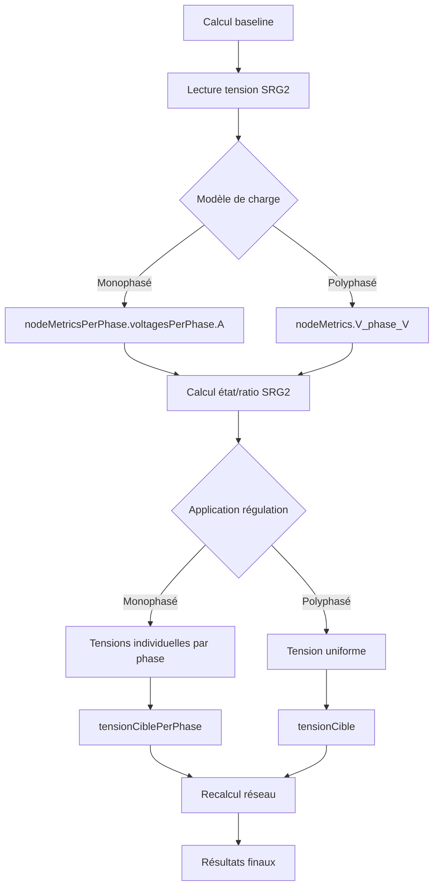

# Documentation Technique : Fonctionnement du SRG2

## Vue d'ensemble

Le régulateur SRG2 (Régulateur de Tension Intelligent) est un système de régulation automatique qui ajuste les tensions du réseau électrique en fonction de conditions prédéfinies. Cette documentation détaille son fonctionnement complet, de la mesure de tension à l'application des corrections.

## Architecture générale

```
1. CAPTATION → 2. CALCUL → 3. APPLICATION → 4. PROPAGATION → 5. RECALCUL
   (tension)     (ratio)    (correction)   (descendants)   (réseau)
```

## 1. Captation de la tension de référence

### Localisation : `src/utils/voltageReference.ts` - `getSRG2ReferenceVoltage()`

La captation de tension diffère selon le modèle de charge :

#### Modèle Polyphasé Équilibré (`polyphase_equilibre`)

```typescript
// Lecture depuis nodeMetrics (tension d'équilibre)
const nodeMetric = calculationResult.nodeMetrics?.find(n => n.nodeId === nodeId);
calculatedVoltage = nodeMetric.V_phase_V; // Tension phase-neutre équilibrée
```

**Variables utilisées :**
- `nodeMetric.V_phase_V` : Tension phase-neutre calculée (généralement ~230V)
- Pas de conversion nécessaire, déjà en phase-neutre

#### Modèle Monophasé Réparti (`monophase_reparti`)

```typescript
// Lecture depuis nodeMetricsPerPhase (tensions par phase)
const nodeMetric = calculationResult.nodeMetricsPerPhase?.find(n => n.nodeId === nodeId);
calculatedVoltage = nodeMetric.voltagesPerPhase.A; // Phase A comme référence
```

**Variables utilisées :**
- `nodeMetric.voltagesPerPhase.A` : Tension de la phase A (référence pour SRG2)
- `nodeMetric.voltagesPerPhase.B` : Tension de la phase B
- `nodeMetric.voltagesPerPhase.C` : Tension de la phase C

### Système de référence unifié

Le SRG2 travaille **toujours** avec une référence de 230V phase-neutre, indépendamment du système électrique :

- **TRIPHASÉ_230V** : Utilise directement les tensions calculées
- **TÉTRAPHASÉ_400V** : Utilise les tensions phase-neutre (~230V)

## 2. Calcul de la régulation

### Localisation : `src/utils/voltageDisplay.ts` - `calculateSRG2Regulation()`

### Seuils de régulation (basés sur 230V)

```typescript
const thresholds = {
  BO2_max: 207,     // 230 * 0.90 - Boost niveau 2
  BO1_max: 218.5,   // 230 * 0.95 - Boost niveau 1  
  BYP_min: 218.5,   // 230 * 0.95 - Bypass min
  BYP_max: 241.5,   // 230 * 1.05 - Bypass max
  LO1_min: 241.5,   // 230 * 1.05 - Lower niveau 1
  LO2_min: 253      // 230 * 1.10 - Lower niveau 2
};
```

### États et ratios de correction

| État | Condition | Ratio | Action |
|------|-----------|-------|--------|
| BO2  | V ≤ 207V  | 1.10  | Boost +10% |
| BO1  | V ≤ 218.5V| 1.05  | Boost +5%  |
| BYP  | 218.5V < V < 241.5V | 1.00 | Pas d'action |
| LO1  | V ≥ 241.5V| 0.95  | Réduction -5% |
| LO2  | V ≥ 253V  | 0.90  | Réduction -10% |

## 3. Application de la régulation

### Localisation : `src/utils/SRG2Regulator.ts` - `apply()`

Le processus d'application suit cette séquence :

1. **Captation** : Lecture de la tension via `getSRG2ReferenceVoltage()`
2. **Calcul** : Détermination de l'état et du ratio via `calculateSRG2Regulation()`
3. **Application** : Calcul des tensions régulées via `calculateRegulatedVoltages()`

### Calcul des tensions régulées

#### Modèle Monophasé Réparti

```typescript
// Application individuelle par phase
return {
  regulatedVoltages: {
    A: phaseVoltages.A * ratio,  // Tension phase A × ratio
    B: phaseVoltages.B * ratio,  // Tension phase B × ratio
    C: phaseVoltages.C * ratio   // Tension phase C × ratio
  },
  phaseRatios: { A: ratio, B: ratio, C: ratio }
};
```

**Exemple pratique :**
- Tensions mesurées : A=262.5V, B=241.2V, C=249.1V
- Ratio calculé : 0.900 (état LO2)
- Tensions régulées : A=236.2V, B=217.1V, C=224.2V

#### Modèle Polyphasé Équilibré

```typescript
// Application uniforme sur toutes les phases
const regulatedVoltage = originalVoltage * ratio;
return {
  regulatedVoltages: {
    A: regulatedVoltage,  // Même tension régulée
    B: regulatedVoltage,  // pour toutes les phases
    C: regulatedVoltage
  },
  phaseRatios: { A: ratio, B: ratio, C: ratio }
};
```

**Exemple pratique :**
- Tension mesurée : 251.3V
- Ratio calculé : 0.950 (état LO1)
- Tensions régulées : A=238.7V, B=238.7V, C=238.7V

## 4. Propagation aux nœuds

### Localisation : `src/utils/simulationCalculator.ts` - `calculateWithSimulation()`

La propagation des tensions régulées vers les nœuds diffère selon le modèle :

#### Application au nœud SRG2

##### Modèle Monophasé
```typescript
// Application par phase individuelle
regulatedProject = {
  ...cleanProject,
  nodes: cleanProject.nodes.map(node => {
    if (node.id === srg2NodeId) {
      return {
        ...node,
        srg2Applied: true,
        srg2State: srg2Result.state,
        srg2Ratio: srg2Result.ratio,
        tensionCiblePerPhase: {  // Tensions différenciées par phase
          A: srg2Result.regulatedVoltages.A,
          B: srg2Result.regulatedVoltages.B,
          C: srg2Result.regulatedVoltages.C
        }
      };
    }
    return node;
  })
};
```

##### Modèle Polyphasé
```typescript
// Application uniforme
regulatedProject = {
  ...cleanProject,
  nodes: cleanProject.nodes.map(node => {
    if (node.id === srg2NodeId) {
      return {
        ...node,
        srg2Applied: true,
        srg2State: srg2Result.state,
        srg2Ratio: srg2Result.ratio,
        tensionCible: srg2Result.regulatedVoltage  // Tension unique
      };
    }
    return node;
  })
};
```

#### Propagation aux descendants

La propagation aux nœuds descendants utilise une logique de parcours d'arbre :

```typescript
// Méthode : propagateVoltageToChildren()
const descendants = this.getDescendants(nodeId, nodes, cables);

for (const descendantId of descendants) {
  const node = nodes.find(n => n.id === descendantId);
  if (node && node.tensionCible) {
    node.tensionCible = node.tensionCible * ratio;
  }
}
```

## 5. Recalcul du réseau

### Localisation : `src/utils/simulationCalculator.ts`

Après application du SRG2, un nouveau calcul électrique est effectué :

```typescript
// Recalcul avec les nouvelles tensions cibles
const finalResult = this.calculateScenario(
  regulatedProject.nodes,    // Nœuds avec tensions régulées
  regulatedProject.cables, 
  regulatedProject.cableTypes,
  scenario,
  // ... autres paramètres
);
```

## Variables de tension dans les nœuds

### Nœuds avec étoile (neutre accessible)

#### TÉTRAPHASÉ_400V + monophase_reparti
- **Tensions de référence** : Phase-Neutre = 230V, Phase-Phase = 400V
- **Variables SRG2** : `tensionCiblePerPhase.A/B/C` (tensions individuelles)
- **Affichage** : Tensions par phase différenciées

#### TÉTRAPHASÉ_400V + polyphase_equilibre  
- **Tensions de référence** : Phase-Neutre = 230V (équilibré)
- **Variables SRG2** : `tensionCible` (tension unique)
- **Affichage** : Tension uniforme sur toutes les phases

### Nœuds sans étoile (pas de neutre)

#### TRIPHASÉ_230V + monophase_reparti
- **Tensions de référence** : Phase-Phase = 230V
- **Variables SRG2** : `tensionCiblePerPhase.A/B/C` (entre phases)
- **Affichage** : Tensions par phase différenciées

#### TRIPHASÉ_230V + polyphase_equilibre
- **Tensions de référence** : Phase-Phase = 230V (équilibré)
- **Variables SRG2** : `tensionCible` (tension unique)
- **Affichage** : Tension uniforme

## Flux de données complet



## Points clés de l'implémentation

1. **Référence uniforme** : Le SRG2 utilise toujours 230V comme référence, indépendamment du système
2. **Lecture adaptative** : Captation différente selon le modèle (équilibré vs déséquilibré)
3. **Application différenciée** : En monophasé, chaque phase est régulée individuellement
4. **Propagation cohérente** : Les descendants héritent des corrections du nœud SRG2
5. **Recalcul complet** : Après régulation, tout le réseau est recalculé avec les nouvelles tensions cibles

Cette architecture garantit une régulation précise et adaptée aux différents types de réseaux électriques.